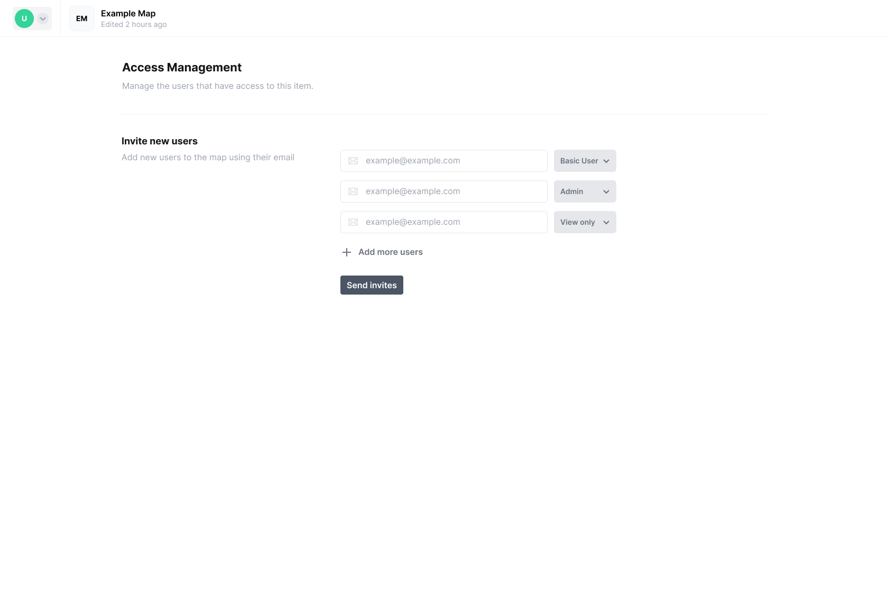

## Before we begin

Please record how much time you spend on the following phases:

- Reading (this readme, the codebase, documentation, etc.)
- Thinking / designing / planning
- Implementing functionality \*
- Refactoring \*

The combined time for phases marked with an asterisk (\*) constitutes your *total time working*. All phase amounts together make up your *total time spent*. Work in the order that best suits you.

Should we end up working together, you will of course **no longer be asked** to do this. I ask for it now because it helps me better evaluate your work.

If this were a ticket, I would go into a bit of depth to share my thoughts on implementation, and we'd have an open door policy to discuss issues as they crop up.
 
Instead, I've written this specification so we can agree on what would constitute a valid solution. That means you shouldn't hesitate to reach out with any questions around these requirements specifically, until you feel like you have a clear picture of the task.

The challenge is intended to be simple to implement. All in all, you should spend no more than a handful of hours of *total time working* on it. You have a total of seven days to hand it in.

---

## Setting up the app

This challenge requires you to run a Rails app. The app itself already has all the scaffolding you need, so once you get it to run, you can get started writing your Elm code.

- [ ] Install Ruby 3.2.0
- [ ] Install PostgreSQL
- [ ] Clone the application
- [ ] Install dependencies by running `bundle install` and `yarn install`
- [ ] Set up the database with `rails db:create`
- [ ] Install foreman with `gem install foreman`
- [ ] Run the app with `foreman start -f Procfile.dev`
- [ ] Open `localhost:3000/pages/example` in your browser

You'll see a message which reads `Replace this with your Elm component.`—you're ready to start writing code!

## The task

You'll be implementing a small frontend component which will be used to invite users to the application. The point of this task is to solely implement the local component, without any interaction with the server.

Please reach out with any questions you have around functionality.

## Your solution

Remember: we're looking for a clear communicator, in prose as well as code. Someone who has reliable technical skill, is wary of feature scope creep, and has a penchant for independence.

A quicker solution (in terms of *total time spent*) beats a slower one, but only if they are of equivalent quality.

A clean, well thought out solution handed in at the last minute with a more sizable amount of *total time spent* is better than a hastily implemented rough-shod solution handed in within a few hours of starting.

Structure your code as you see fit—i.e. change, add, and remove files at your leisure.

Be precise in your implementation and, where useful, verbose in your code comments and commit messages. If you'd like to, you can attach any notes you take as you work.

When reviewing your solution, I expect to be able to open the app, and interact with the component.

In general, share what information you deem useful, and withhold what you deem irrelevant.

> For example, when tracking time, total time per phase is what matters. If you had to e.g. go back to the drawing board multiple times and you feel like knowing about this will help my understanding of your commit history, you may decide to e.g. additionally share how you alternated between phases.

## Submitting

Once you've implemented the Elm component, you're done :)

Please:
- [ ] Submit your code using GitHub
- [ ] Send any additional documentation, such as your recorded times, via email
